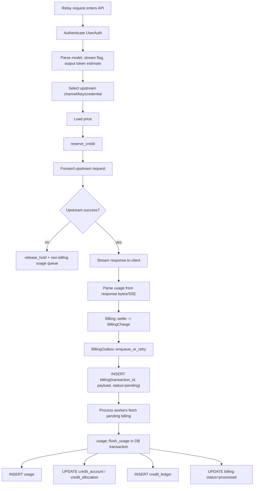

# Billing Outbox and Credit Debit Flow

本文档记录 NeoGate 当前计费 outbox、额度预占、扣费落库和用量记录的完整流程。内容基于当前代码实现，主要涉及：

- `backend/src/relay/mod.rs`
- `backend/src/relay/streaming.rs`
- `backend/src/billing/mod.rs`
- `backend/src/billing/outbox.rs`
- `backend/src/billing/account.rs`
- `backend/src/usage/recorder.rs`
- `backend/src/task/billing.rs`
- `backend/src/health.rs`

## 目标

计费链路的目标是：

1. 请求热路径尽量少做数据库写入。
2. 计费模式下保证用量和扣费完整记录。
3. 内部模式下兼容“调用需要额度”和“调用不需要额度”两种策略。
4. 对客户端断开、上游失败、用量缺失、后台任务终态等情况保持资源可恢复。
5. 用 durable outbox 将“响应返回”和“最终 usage/ledger 落库”解耦。

## 总体流程



热路径的关键点是：请求成功后不会直接写 `usage`、`credit_ledger` 和最终扣费行，而是先把完整 `UsageInsert` 序列化为 `billing.payload`。后台 worker 再异步处理 `billing.status = 'pending'` 的记录。

## 模式语义

NeoGate 的计费行为由 `service_policy.credit_required` 决定，`service_mode` 主要影响产品语义。

### Paid 模式

付费模式下通常 `credit_required = true`。

- 请求前必须预占额度。
- 成功请求必须生成 `BillingCharge`。
- `BillingCharge` 必须进入 `billing` durable outbox。
- outbox 后台最终写入 `usage`、扣减 `credit_account.balance_micro_usd` 和 `reserved_micro_usd`，并写入 `credit_ledger`。
- 如果实际用量缺失，同步 relay 会按预估费用记录 `billing_status = 'usage_missing'`。
- 如果实际费用超过预占费用，会尝试补充预占；补充失败时按已预占金额扣费，并记录 `billing_status = 'undercharged'`。

### Internal 模式，调用需要额度

内部模式但 `credit_required = true` 时，扣费路径与付费模式一致：

- 仍然按 `project -> user_key -> user_key_model` 的额度账户体系预占和扣减。
- usage、cost、ledger 都完整记录。
- 适合内部预算、部门额度、项目成本控制。

### Internal 模式，调用不需要额度

内部模式且 `credit_required = false` 时：

- `reserve_credit` 仍会返回一个 `DebitHold`，但 `charge_credit = false`，`parts = []`。
- `Billing::settle` 仍计算 `cost_micro_usd`、tokens 和 `billing_status`。
- `UsageInsert.billing` 仍为 `Some(BillingCharge)`，因此仍进入 `billing` outbox。
- 后台处理时会写 `usage.cost_micro_usd`、`billing_status`、`billing_transaction_id`。
- 因为没有 `parts` 和 `returned_parts`，不会更新 `credit_account`，也不会写 `credit_ledger` usage 扣费流水。

也就是说，“不需要额度”不是“不记录用量”，而是“不扣余额”。用量和成本仍会被完整记录。

## 请求热路径

同步 relay 的入口在 provider handler 中，例如 OpenAI：

1. `RelayBody` 读取请求体。
2. `prepare_relay_body` 解析模型、stream 标记、输出 token 估算。
3. `auth.ensure_model_allowed` 检查 key 的模型权限。
4. `selector.select` 选择上游 channel、endpoint、key 或 credential。
5. `billing.price_for` 从 `provider_price` 和 `pricing_policy` 计算价格，带内存 TTL cache。
6. `reserve_credit` 根据策略决定是否真正预占额度。
7. `forward_openai` / `forward_anthropic` 发起上游请求。
8. `finish_relay` 将上游响应包装成流式响应体。

`RelayContext` 会携带以下计费所需信息直到响应流结束：

- `UserAuth`
- `SelectedUpstream`
- `protocol`
- `model`
- `streamed`
- `price`
- `DebitHold`
- `user_key_model_credit_account`
- `started`

## 额度预占

预占入口是 `Billing::reserve`。

### 预占顺序

`ordered_credit_accounts` 按如下顺序消费额度：

1. `user_key_model` 级账户，如果该 key 对应模型存在独立账户。
2. `user_key` 级账户。
3. `project` 级账户。

### Hot credit

`Billing` 内部有 hot credit store：

- standalone 模式使用内存实现。
- distributed 模式使用 Redis 实现。

请求优先从 hot credit 中扣预占金额，避免每次请求都锁数据库账户行。

### Prefetch

如果 hot credit 不足：

1. 根据账户组合进入 64 个 `prefetch_locks` 之一，减少同一账户组合的并发回源。
2. 开启数据库事务。
3. 按账户优先级查询 `credit_account`，并 `FOR UPDATE` 锁住账户行。
4. 更新 `credit_account.reserved_micro_usd += amount`。
5. 插入 `credit_allocation`，记录本次转入 hot credit 的 allocation。
6. 提交事务。
7. 把 allocation 额度写入 hot credit store。

`CREDIT_PREFETCH_MICRO_USD` 控制每次从数据库预取到 hot credit 的目标额度。预取越大，DB 锁频率越低，但异常恢复窗口内的预占金额也更大。

### 不需要额度时

如果 `policy::credit_required(state)` 返回 false，`reserve_credit` 不调用 `Billing::reserve`，而是生成：

```text
DebitHold {
  transaction_id: new uuid,
  estimated_micro_usd: estimated,
  parts: [],
  charge_credit: false
}
```

后续仍会计算费用和记录 usage，但不会扣余额。

## 响应完成与结算

响应体由 `relay/streaming.rs` 的 `StreamingRelay` 管理。

### 成功完成

响应流正常结束时：

1. `ResponseUsageParser` 从 JSON body 或 SSE data 中解析 usage。
2. `settle_successful_hold` 调用 `Billing::settle`。
3. `usage_from_context` 生成 `UsageInsert`。
4. `enqueue_relay_usage` 发现 `billing.is_some()`，进入 `BillingOutbox::enqueue_or_retry`。

### 客户端提前断开

`StreamingRelay` 实现了 `Drop`：

- 如果响应 status 是成功，仍会尝试用已观察到的 usage 结算。
- 如果 usage 缺失，同步 relay 会进入 `usage_missing` 语义，按预估值结算。
- 这保证成功上游请求在客户端断开时也尽量不丢计费。

### 上游失败

上游 HTTP 非 2xx 或 transport error 时：

1. 释放预占额度：`billing.release_hold`。
2. 生成非 billing 的 `UsageInsert`。
3. 写入普通 `UsageRecorder` 队列。
4. 根据错误和是否存在备用 channel，可能记录 `KeyFailure` 并冷却上游 key。

失败请求不会进入 `billing` durable outbox，因为没有实际成功用量需要扣费。

### settle 规则

`Billing::settle` 的核心规则：

- `usage = Some(TokenUsage)`：按真实 usage 和价格计算 `cost_micro_usd`，状态为 `billed`。
- `usage = None`：按预估金额结算，状态为 `usage_missing`。
- `charge_credit = false`：返回 `BillingCharge`，但 `parts = []`，不扣余额。
- 实际费用大于预估：尝试 supplemental reserve。
- supplemental reserve 失败：只扣已预占金额，状态为 `undercharged`。
- 实际费用小于预估：多余部分通过 hot credit refund，并记录 `returned_parts`，后台落库时释放 reserved。

## Durable Billing Outbox

`BillingOutbox::spawn` 会启动三个角色：

1. writer worker：从内存 channel 批量写 `billing` 表。
2. retry worker：writer channel 满或写失败时做有界后台重试。
3. process workers：处理 `billing.status = 'pending'` 的 durable 记录，只有 `PROCESS_ROLE` 包含 background 时启动。

当前常量：

```text
BILLING_BATCH_SIZE = 500
BILLING_PROCESS_CHUNK_SIZE = 500
BILLING_MAX_BATCHES_PER_TICK = 40
BILLING_PROCESS_WORKERS = 4
BILLING_MAX_ATTEMPTS = 10
BILLING_OUTBOX_WRITE_ATTEMPTS = 7
```

writer 队列大小和 tick 周期来自：

```text
USAGE_QUEUE_SIZE
USAGE_FLUSH_INTERVAL_SECONDS
```

### enqueue_or_retry

`enqueue_or_retry` 是 relay 成功结算后的常用入口。

- `usage.billing.is_none()`：直接返回，不进入 outbox。
- sender 可用且未满：`try_send` 到 writer channel。
- sender 满：记录 write failure，并把 usage 放入 retry channel。
- retry channel 满或关闭：记录 error，此时有丢失风险。

这里使用 `try_send`，不会在响应热路径等待 outbox channel。

### writer worker

writer worker 收到 `UsageInsert` 后：

1. 从 channel 尽量凑到 `BILLING_BATCH_SIZE`。
2. 将每条 `UsageInsert` 序列化成 JSON。
3. 批量插入：

```sql
INSERT INTO billing (transaction_id, payload)
VALUES ...
ON CONFLICT (transaction_id) DO NOTHING
```

`transaction_id` 是幂等键，来自 `DebitHold.transaction_id`。

### retry worker

retry worker 会：

1. 从 retry channel 批量取 usage。
2. 调用不带有限次数的 `persist_billing_usages`。
3. 写失败时指数退避，从 1s 到 60s。
4. 成功后恢复 write health。

## Pending Billing Processing

process worker 每个 tick 最多处理 `BILLING_MAX_BATCHES_PER_TICK` 个 batch。

### 选择 pending 记录

每个 chunk 在事务内执行：

```sql
SELECT id, transaction_id, payload
FROM billing
WHERE status = 'pending'
  AND NOT (id = ANY($2::BIGINT[]))
ORDER BY attempts ASC, created_at ASC
LIMIT $1
FOR UPDATE SKIP LOCKED
```

`FOR UPDATE SKIP LOCKED` 允许多个 process worker 并发处理不同记录。

### 批量处理

批量路径：

1. 解码 `billing.payload` 为 `UsageInsert`。
2. 校验 payload 内的 `billing.transaction_id` 与行上的 `transaction_id` 一致。
3. 在同一个事务里调用 `usage::flush_usage`。
4. 将对应 `billing` 行更新为 `processed`。
5. 提交事务。
6. 提交后记录 activity 和 daily aggregate 到内存聚合器。

### 单条 fallback

如果批量解码或批量 flush 失败：

1. 回滚批量事务。
2. 对已选记录逐条处理。
3. 单条失败时，`attempts += 1`。
4. `attempts >= 10` 时将该 billing 行标记为 `failed`。
5. `last_error` 最多保存 500 字符。

## Usage Flush and Debit Persistence

`usage::flush_usage` 是最终落库和扣余额的位置。

### billing 有扣费 parts

如果 `UsageInsert.billing` 存在，并且 `parts` 或 `returned_parts` 非空：

1. 先单条 `INSERT INTO usage ... RETURNING id`，拿到 `usage_id`。
2. 对 `billing.parts` 按 `(credit_account_id, allocation_id)` 合并。
3. 对每个合并后的 part：
   - `UPDATE credit_account SET balance_micro_usd -= amount, reserved_micro_usd -= amount`
   - `UPDATE credit_allocation SET consumed_micro_usd += amount`
   - `INSERT INTO credit_ledger`，`reason = 'usage'`，金额为负数。
4. 对每个 `returned_part`：
   - `UPDATE credit_account SET reserved_micro_usd -= amount`
   - `UPDATE credit_allocation SET returned_micro_usd += amount`

这些操作与 `usage` 插入在同一个数据库事务里。

### billing 无扣费 parts

以下情况会走批量 `flush_unbilled_usage`：

- `billing.is_none()` 的普通 usage。
- `billing.is_some()` 但 `parts` 和 `returned_parts` 都为空。

第二种情况对应内部不需要额度，或费用为 0 的 billing usage。它仍会写入：

- `usage.cost_micro_usd`
- `usage.billing_status`
- `usage.billing_transaction_id`
- tokens 和 latency 等完整字段

但不会更新 `credit_account`，也不会写 `credit_ledger`。

## Activity and Daily Aggregates

`usage::flush_usage` 提交成功后，outbox process worker 会调用：

- `ActivityRecorder::record`
- `UsageDailyRecorder::record`

它们先写入内存聚合器，再由后台 worker 定期批量落库：

- `channel_key.last_used_at`
- `user_key.last_active_at`
- `project_member.last_active_at`
- `user.last_active_at`
- `usage_daily`

activity 和 daily 聚合不在 billing outbox 主事务内。主 usage 和扣费成功后，即使聚合稍后失败，也不会回滚 billing 处理。

## Async Task Billing

异步任务使用同一套 `DebitHold`、`Billing::settle` 和 `BillingOutbox`。

主要入口是 `backend/src/task/billing.rs`：

- 创建 async task 时预占额度，并把 hold 存在 `task_upstream.billing_hold`。
- 任务终态有 usage 时：
  1. `mark_billing_status(..., "held", "settled")`
  2. 查询 price
  3. `Billing::settle`
  4. `billing_outbox.enqueue_or_retry(UsageInsert { billing: Some(...) })`
- 任务终态没有 usage 时：
  1. `mark_billing_status(..., "held", "released")`
  2. `release_hold`

这与同步 relay 的 `usage_missing` 策略不同：当前 async task 终态没有 usage 时释放 hold，不按预估扣费。

## 健康检查

`/readyz` 检查：

1. 数据库是否可用。
2. Redis 是否可用，如果运行在 distributed 模式。
3. billing outbox write health。
4. billing pending backlog。

backlog 查询只采样 `BILLING_OUTBOX_MAX_PENDING + 1` 条 pending 记录，避免全表 count。

ready 条件：

```text
pending_count <= BILLING_OUTBOX_MAX_PENDING
oldest_pending_age_seconds <= BILLING_OUTBOX_MAX_AGE_SECONDS
write_status.healthy = true
```

如果 pending 数超过阈值，服务会返回 503 readyz，但 API 进程本身仍可能继续处理请求。

## 失败与恢复

### outbox 写失败

writer 写 `billing` 失败会：

- 标记 write health failed。
- 有限重试 7 次，初始 50ms 指数退避。
- 仍失败则进入 retry worker。
- retry worker 继续指数退避写 durable outbox。

### outbox process 失败

process 失败会：

- 批量失败转单条重试。
- 单条失败增加 `billing.attempts`。
- 达到 10 次后 `billing.status = 'failed'`。

failed billing 需要运维介入，因为它代表 durable usage/扣费记录没有完成最终落库。

### hot credit allocation 恢复

如果额度已从 DB reserved 转入 hot credit，但后续没有被消费或返还，`spawn_allocation_recovery` 会定期恢复 stale allocation。

恢复会跳过仍被 pending billing payload 引用的 allocation，避免 outbox 尚未处理时提前释放 reserved。

恢复动作包括：

- 从 hot store 移除 stale allocation。
- `credit_account.reserved_micro_usd -= recover_amount`
- `credit_allocation.status = 'recovered'`
- 写 `credit_ledger`，`reason = 'allocation_recover'`

## 当前性能关注点

压测中已经观察到的主要瓶颈在 outbox process 和最终扣费落库，而不是上游转发本身。

症状：

- `billing outbox queue is full; queueing bounded background retry`
- `UPDATE credit_account SET balance_micro_usd ... reserved_micro_usd ...` 出现 1s 以上慢查询。
- 高 billable QPS 下 pending backlog 短时超过 readyz 阈值。
- p99 延迟被 outbox 队列和数据库行锁竞争拉高。

原因：

- 同一个 user key 或 project 的高并发请求最终会落到相同 `credit_account` 行。
- `flush_billing_part` 当前按 usage/part 逐条更新 `credit_account` 和 `credit_allocation`。
- `billing.parts` 只在单个 usage 内合并，没有跨 batch 按账户聚合。
- process worker 并发处理时会增加同一账户行的锁竞争。

后续优化应优先保持以下不变量：

- 每条成功 billable usage 都必须有 durable `billing` 记录。
- `billing.transaction_id` 继续作为幂等键。
- `usage` 明细不能丢。
- `credit_ledger` 需要能追溯 usage、allocation 和 transaction。
- 内部不需要额度模式仍要记录 usage/cost，但不得扣余额。

可优化方向：

- 将 outbox batch size、process worker 数、每 tick batch 数改为配置项。
- 对 `billing outbox queue is full` 做日志限频，避免高峰期日志放大。
- 在 `usage::flush_usage` 中对同一批次的 debit parts 按 `credit_account_id` 聚合更新余额，同时保留每条 usage 的 ledger 可追溯性。
- 将 API 和 worker 拆分为不同 `PROCESS_ROLE`，让 API 进程只写 outbox，由 worker 进程专门处理 durable billing。
- 针对单个高流量账户限制 process 并发，减少同一 `credit_account` 行锁竞争。
