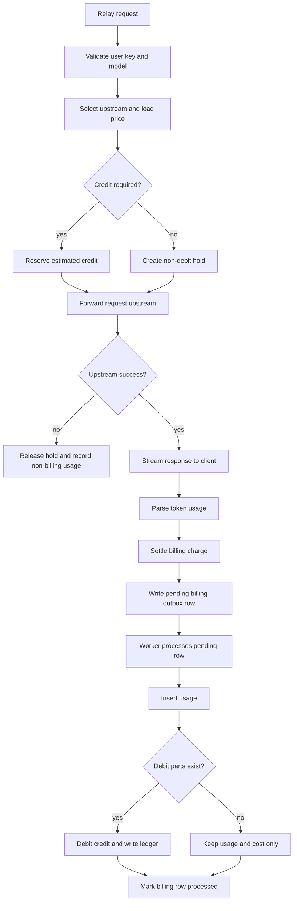

# Billing Outbox Flow Design

This document records the core Billing Outbox model for NeoGate.

The goal is to keep request handling fast while still making successful billable usage durable, traceable, and recoverable.

```text
Relay request returns the upstream response.
Billing outbox stores the settled usage event durably.
Background workers persist usage, debit credit, and write ledger records.
```

## Flow Diagram



## Core Concepts

### Usage

`Usage` represents one model call observed by NeoGate.

It records the request identity, model, upstream channel, token usage, latency, cost, and billing status. Usage is the main query surface for cost analysis, troubleshooting, and reporting.

### Credit Account

`CreditAccount` represents spendable balance or budget.

Credit can be attached at different levels:

```text
Project
UserKey
UserKeyModel
```

Billing should prefer the most specific available account first, then fall back to broader accounts. The normal debit order is:

```text
UserKeyModel -> UserKey -> Project
```

### Debit Hold

`DebitHold` represents credit reserved before a request is sent upstream.

NeoGate estimates the maximum possible cost, reserves credit from the selected accounts, and attaches a transaction id to the request. The hold keeps successful responses from exceeding the available balance while allowing final cost to be settled after usage is known.

### Billing Charge

`BillingCharge` represents the final billing decision for a completed request.

It includes:

- the billing transaction id
- the final cost
- the billing status
- debit parts for accounts and allocations
- returned parts when the final cost is lower than the reserved amount

### Billing Outbox

`BillingOutbox` is the durable handoff between the response path and final database persistence.

The request path does not directly write the final usage row, debit account balance, and create ledger entries. Instead, it writes a pending billing event. Background workers later process pending events in database transactions.

This makes billing resilient to process restarts, short database slowdowns, and worker retries.

### Credit Ledger

`CreditLedger` is the audit trail for balance changes.

Every real credit debit should be traceable back to the usage record, credit account, allocation, and billing transaction.

## Service Mode Semantics

NeoGate supports both internal mode and billing mode with the same billing flow. The important switch is whether a service policy requires credit.

### Credit Required

When credit is required:

1. A request must reserve credit before it reaches the upstream provider.
2. A successful request produces a `BillingCharge`.
3. The billing charge is written to the billing outbox.
4. A background worker writes usage, debits credit, and records ledger entries.

This applies to paid billing mode and to internal deployments that use project budgets or departmental quotas.

### Credit Not Required

When credit is not required:

1. NeoGate still creates a billing transaction id.
2. It still calculates tokens, cost, and billing status.
3. It still writes usage through the billing outbox.
4. It does not debit credit accounts or write usage debit ledger entries.

This mode means "record usage and cost without spending balance." It does not mean "skip usage tracking."

## Request Flow

The synchronous relay flow is:

```text
1. Validate the user key and model permission.
2. Select an upstream channel, key, or credential.
3. Load the model price.
4. Reserve estimated credit when policy requires it.
5. Forward the request to the upstream provider.
6. Stream the response back to the client.
7. Parse token usage from the final response body or stream events.
8. Settle the debit hold into a billing charge.
9. Enqueue the settled usage event into the billing outbox.
```

The important boundary is between steps 8 and 9. Once a successful billable request has been settled, the billing outbox becomes responsible for durable persistence and retry.

## Settlement Rules

Settlement compares the reserved estimate with the final observed usage.

```text
usage available
  Charge the actual calculated cost.

usage missing
  Charge the estimate and mark the billing status as usage_missing.

actual cost lower than estimate
  Charge the actual cost and return the unused reserved amount.

actual cost higher than estimate
  Try to reserve the difference. If that fails, charge the reserved amount and mark the billing status as undercharged.

credit not required
  Keep cost and billing status, but produce no debit parts.
```

These rules let NeoGate preserve usage and billing intent even when upstream providers omit usage details or when the client disconnects early after a successful upstream response.

## Outbox Processing Flow

The durable processing flow is:

```text
1. The relay enqueues a settled usage event.
2. The outbox writer inserts a pending billing row.
3. Process workers select pending rows with row locks.
4. Each payload is decoded back into a usage event.
5. Usage, credit debits, returned reservations, and ledger entries are written in one database transaction.
6. The billing row is marked as processed.
7. Activity and daily usage aggregates are updated after the main transaction succeeds.
```

The billing transaction id is the idempotency key. Retrying the same transaction should not create duplicate billing records.

## Failure and Recovery

### Upstream Failure

If the upstream request fails before successful usage exists, NeoGate releases the debit hold and records non-billing usage metadata. The request does not enter the durable billing outbox.

### Client Disconnect

If the client disconnects after the upstream request succeeds, NeoGate still tries to settle with any usage already observed from the response stream. If usage is missing, the request can still be settled with `usage_missing` semantics.

### Outbox Write Failure

If the in-memory outbox writer cannot persist immediately, the event is retried in the background. The request path does not wait for the full final billing transaction.

### Outbox Processing Failure

If a pending billing row cannot be processed, workers retry it. A permanently failed row requires operational attention because it means durable usage and debit persistence did not complete.

### Stale Reservation Recovery

Credit moved into hot reservation state can be recovered later if it is no longer referenced by pending billing work. Recovery must not release credit that may still be needed by an unprocessed outbox payload.

## Summary

The Billing Outbox model separates request completion from final billing persistence.

```text
Request path:
  validate -> reserve -> call upstream -> settle -> enqueue outbox

Worker path:
  read pending outbox -> insert usage -> debit credit -> write ledger -> mark processed
```

This keeps successful usage durable, preserves a traceable credit ledger, supports both paid and internal modes, and allows the system to recover from transient failures without putting the full billing transaction on the request hot path.
