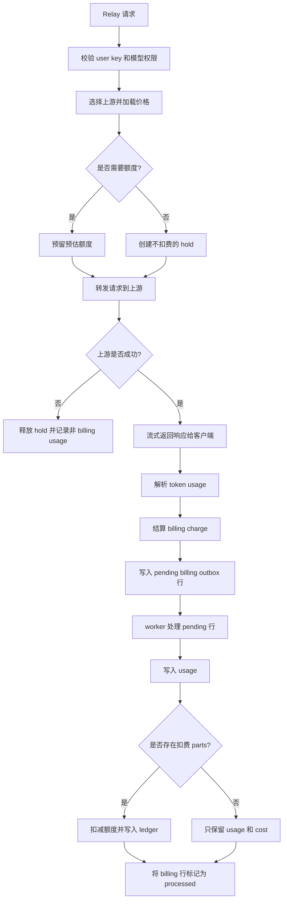

# Billing Outbox 流程设计

本文档记录 NeoGate 中 Billing Outbox 的核心模型。

目标是在保持请求处理路径足够轻量的同时，让成功的可计费用量具备持久性、可追踪性和可恢复性。

```text
Relay 请求返回上游响应。
Billing outbox 持久保存已结算的 usage 事件。
后台 worker 持久化 usage、扣减额度，并写入 ledger 记录。
```

## 流程图



## 核心概念

### Usage

`Usage` 表示 NeoGate 观测到的一次模型调用。

它记录请求身份、模型、上游 channel、token 用量、延迟、成本和 billing 状态。Usage 是成本分析、问题排查和报表统计的主要查询对象。

### Credit Account

`CreditAccount` 表示可消费的余额或预算。

额度可以挂在不同层级：

```text
Project
UserKey
UserKeyModel
```

计费时应优先使用最具体的账户，再逐级回退到更宽泛的账户。正常扣费顺序是：

```text
UserKeyModel -> UserKey -> Project
```

### Debit Hold

`DebitHold` 表示请求发往上游前预留的额度。

NeoGate 会估算请求可能产生的最大成本，从选定账户中预留额度，并为该请求关联一个 transaction id。hold 可以避免成功响应超过可用余额，同时允许系统在真实 usage 可知后再结算最终成本。

### Billing Charge

`BillingCharge` 表示一次已完成请求的最终计费决策。

它包含：

- billing transaction id
- 最终成本
- billing 状态
- 账户和 allocation 的扣费 parts
- 当最终成本低于预留金额时需要返还的 parts

### Billing Outbox

`BillingOutbox` 是响应路径与最终数据库持久化之间的 durable handoff。

请求路径不会直接写入最终 usage 行、扣减账户余额并创建 ledger 记录。它会先写入一条 pending billing 事件，之后由后台 worker 在数据库事务中处理这些 pending 事件。

这让 billing 可以应对进程重启、短时间数据库变慢和 worker 重试。

### Credit Ledger

`CreditLedger` 是余额变更的审计记录。

每一次真实额度扣减都应该能追溯到 usage 记录、credit account、allocation 和 billing transaction。

## 服务模式语义

NeoGate 使用同一套 billing flow 支持 internal mode 和 billing mode。关键开关是 service policy 是否要求额度。

### 需要额度

当请求需要额度时：

1. 请求到达上游 provider 前必须先预留额度。
2. 成功请求会生成 `BillingCharge`。
3. billing charge 会写入 billing outbox。
4. 后台 worker 写入 usage、扣减额度，并记录 ledger。

这适用于付费 billing mode，也适用于使用项目预算或部门额度的内部部署。

### 不需要额度

当请求不需要额度时：

1. NeoGate 仍会创建 billing transaction id。
2. 仍会计算 tokens、cost 和 billing 状态。
3. 仍会通过 billing outbox 写入 usage。
4. 不会扣减 credit account，也不会写入 usage 扣费 ledger。

这个模式的含义是“记录用量和成本，但不消费余额”，不是“跳过用量记录”。

## 请求流程

同步 relay 流程如下：

```text
1. 校验 user key 和模型权限。
2. 选择上游 channel、key 或 credential。
3. 加载模型价格。
4. 当策略要求额度时，预留预估额度。
5. 将请求转发给上游 provider。
6. 将响应流式返回给客户端。
7. 从最终响应 body 或 stream event 中解析 token usage。
8. 将 debit hold 结算为 billing charge。
9. 将已结算的 usage 事件放入 billing outbox。
```

关键边界在第 8 步和第 9 步之间。一旦成功的可计费请求完成结算，billing outbox 就负责之后的 durable persistence 和 retry。

## 结算规则

结算会比较预留估算值和最终观测到的 usage。

```text
usage available
  按真实计算成本扣费。

usage missing
  按预估金额扣费，并将 billing status 标记为 usage_missing。

actual cost lower than estimate
  按真实成本扣费，并返还未使用的预留金额。

actual cost higher than estimate
  尝试补充预留差额。如果失败，则只扣已预留金额，并将 billing status 标记为 undercharged。

credit not required
  保留 cost 和 billing status，但不产生 debit parts。
```

这些规则让 NeoGate 即使在上游 provider 省略 usage 信息，或客户端在上游成功响应后提前断开时，也能保留 usage 和 billing 意图。

## Outbox 处理流程

durable 处理流程如下：

```text
1. relay 放入已结算的 usage 事件。
2. outbox writer 插入一条 pending billing 行。
3. process worker 使用行锁选择 pending 行。
4. 每个 payload 被解码回 usage 事件。
5. usage、credit debits、returned reservations 和 ledger entries 在同一个数据库事务中写入。
6. billing 行标记为 processed。
7. 主事务成功后，更新 activity 和 daily usage aggregates。
```

billing transaction id 是幂等键。重试同一个 transaction 不应该产生重复 billing 记录。

## 失败与恢复

### 上游失败

如果上游请求在产生成功 usage 之前失败，NeoGate 会释放 debit hold，并记录非 billing usage 元数据。该请求不会进入 durable billing outbox。

### 客户端断开

如果客户端在上游请求成功后断开，NeoGate 仍会尝试使用响应流中已经观测到的 usage 完成结算。如果 usage 缺失，该请求仍可以按 `usage_missing` 语义结算。

### Outbox 写入失败

如果内存 outbox writer 不能立即持久化事件，该事件会在后台重试。请求路径不会等待完整的最终 billing 事务完成。

### Outbox 处理失败

如果某条 pending billing 行无法处理，worker 会重试。永久失败的行需要运维介入，因为它意味着 durable usage 和扣费持久化没有完成。

### 过期预留恢复

被转入 hot reservation 状态的额度，如果不再被 pending billing work 引用，可以在之后恢复。恢复逻辑不能释放仍可能被未处理 outbox payload 使用的额度。

## 总结

Billing Outbox 模型将请求完成与最终 billing 持久化解耦。

```text
Request path:
  validate -> reserve -> call upstream -> settle -> enqueue outbox

Worker path:
  read pending outbox -> insert usage -> debit credit -> write ledger -> mark processed
```

这让成功 usage 具备持久性，保留可追踪的 credit ledger，同时支持 paid 和 internal 两种模式，并让系统可以从短暂故障中恢复，而不需要把完整 billing 事务放到请求热路径上。
