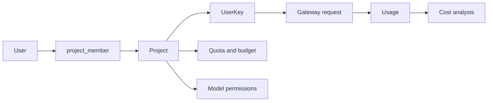

# Project Model Design

This document records the planned Project model for NeoGate Community Edition.

The goal is to evolve NeoGate from a primarily `User -> UserKey` model into:

```text
User -- Project -- UserKey
```

Project becomes the main resource, quota, permission, and usage attribution unit. This supports both internal mode and billing mode with one shared data model.

## Model Flow



## Core Concepts

### User

`User` represents a person.

A user logs in to the console, performs operations, and joins projects through membership. A user should not be the primary quota or cost attribution unit after the Project model is introduced.

### Project

`Project` represents a business unit for model usage.

In internal mode, a project can represent:

- an internal project
- a business application
- a department cost unit
- a team-owned LLM entry point

In billing mode, a project can represent:

- a user's default account space
- an application
- a billing and usage space

Project is the main place for:

- members
- API keys
- model permissions
- budgets and quota
- usage attribution
- cost analysis

### UserKey

`UserKey` represents an API credential used to call NeoGate.

The table can keep the existing `user_key` name for compatibility, but its ownership should move to Project. A user key belongs to one project.

Recommended fields:

```text
user_key
  id
  project_id
  owner_user_id nullable
  name
  key_prefix
  secret_ciphertext
  status
  expires_at
  model_limits
```

`owner_user_id` describes key visibility and personal ownership inside a project:

```text
owner_user_id IS NULL
  Shared project key.

owner_user_id = user.id
  Personal key under this project.
```

Do not use `user_id = 0` as a sentinel value for shared keys. `NULL` keeps the data model clear and allows real foreign key constraints.

## Relationship Model

The target relationship is:

```text
User <-- project_member --> Project <-- UserKey --> Usage
```

Recommended tables:

```text
project
  id
  name
  owner_user_id
  status
  is_default
  created_at
  updated_at

project_member
  id
  project_id
  user_id
  role
  created_at
  updated_at
```

Suggested project member roles:

```text
owner
  Full project control.

admin
  Manage members, keys, budget, and project settings.

member
  Use the project and manage own keys.

viewer
  Read-only access to project data.
```

## Service Mode Semantics

NeoGate has two service modes:

- internal mode
- billing mode

Both modes should use the same Project data model. The difference is product behavior and UI wording, not separate database models.

### Internal Mode

In internal mode:

```text
User = team member
Project = internal project, application, or cost center
UserKey = project API key
```

Typical flow:

1. An admin creates a project, such as `Customer Support Bot` or `R&D Assistant`.
2. The admin or project owner adds members.
3. Project members create user keys under the project.
4. Business systems call NeoGate through those user keys.
5. Usage, cost, and model consumption are attributed to the project.

Quota semantics:

```text
Project quota = project budget
UserKey quota = optional key-level sub-budget
User quota = hidden or compatibility-only
```

Internal mode should emphasize:

- project members
- project keys
- project usage
- project budget
- project model permissions
- internal cost attribution

### Billing Mode

In billing mode:

```text
User = registered customer and payer
Project = default account space, application, or billing space
UserKey = API key under the project
```

Typical flow:

1. A user registers.
2. NeoGate automatically creates a default project for the user.
3. Recharge or granted credit goes into the default project.
4. The user creates user keys under the project.
5. API calls spend the project balance.
6. Usage can be viewed by project and user key.

Billing mode can initially hide most project complexity in the UI:

- show `Account balance` instead of `Project balance`
- show API keys from the default project
- show usage from the default project
- open multi-project management later if needed

Quota semantics:

```text
Project quota = account balance
UserKey quota = optional spending cap
User = payer and login identity, not the main balance account
```

## Quota Model

After Project is introduced, quota should be centered around Project:

```text
User
  Not the primary quota unit.

Project
  Primary quota, budget, or account balance.

UserKey
  Optional sub-quota or spending cap.

UserKeyModel
  Optional model-level sub-quota.
```

Request validation and billing should follow this order:

```text
1. Validate UserKey.
2. Validate Project.
3. Validate model permissions.
4. Validate Project quota or budget.
5. Validate UserKey quota if configured.
6. Validate model-level quota if configured.
7. Record usage with project_id.
```

Final cost attribution should prefer:

```text
Project > UserKey > Model > Channel
```

## Summary

The Project model is not just a page or a label. It is the core governance unit for NeoGate Community Edition.

```text
User logs in and operates.
Project owns quota, permissions, keys, and usage attribution.
UserKey calls the gateway.
```

This keeps internal mode and billing mode on one shared foundation while leaving room for future enterprise features such as organizations, departments, SSO, audit logs, and advanced RBAC.
