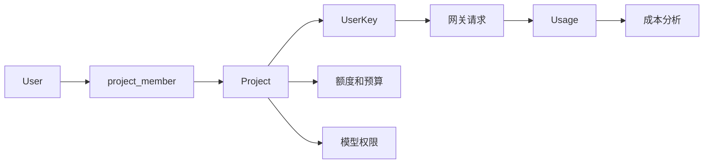

# Project 模型设计

本文档记录 NeoGate Community Edition 计划中的 Project 模型。

目标是将 NeoGate 从主要基于 `User -> UserKey` 的模型演进为：

```text
User -- Project -- UserKey
```

Project 会成为主要的资源、额度、权限和用量归因单元。这样 internal mode 和 billing mode 可以共享同一套数据模型。

## 模型流程图



## 核心概念

### User

`User` 表示一个人。

用户登录控制台、执行操作，并通过成员关系加入项目。引入 Project 模型后，用户不应该再作为主要的额度或成本归因单元。

### Project

`Project` 表示模型使用的业务单元。

在 internal mode 中，project 可以表示：

- 内部项目
- 业务应用
- 部门成本单元
- 团队拥有的 LLM 入口

在 billing mode 中，project 可以表示：

- 用户默认账户空间
- 应用
- billing 和 usage 空间

Project 是以下内容的主要承载位置：

- 成员
- API keys
- 模型权限
- 预算和额度
- 用量归因
- 成本分析

### UserKey

`UserKey` 表示用于调用 NeoGate 的 API credential。

表名可以为了兼容性继续使用现有的 `user_key`，但它的所有权应该迁移到 Project。一个 user key 属于一个 project。

推荐字段：

```text
user_key
  id
  project_id
  owner_user_id nullable
  name
  key_prefix
  secret_ciphertext
  status
  expires_at
```

项目级模型权限由 `project_model` 单独承载。

`owner_user_id` 描述 key 在 project 内的可见性和个人所有权：

```text
owner_user_id IS NULL
  共享 project key。

owner_user_id = user.id
  该 project 下的个人 key。
```

不要使用 `user_id = 0` 作为共享 key 的哨兵值。`NULL` 能让数据模型更清晰，也允许使用真实的外键约束。

## 关系模型

目标关系是：

```text
User <-- project_member --> Project <-- UserKey --> Usage
```

推荐表结构：

```text
project
  id
  name
  owner_user_id
  status
  is_default
  created_at
  updated_at

project_member
  id
  project_id
  user_id
  role
  created_at
  updated_at
```

建议的 project member roles：

```text
owner
  完整的 project 控制权限。

admin
  管理成员、keys、预算和 project 设置。

member
  使用 project，并管理自己的 keys。

viewer
  只读访问 project 数据。
```

## 服务模式语义

NeoGate 有两种 service modes：

- internal mode
- billing mode

两种模式都应使用同一套 Project 数据模型。差异应该体现在产品行为和 UI 文案上，而不是分裂成不同的数据库模型。

### Internal Mode

在 internal mode 中：

```text
User = team member
Project = internal project, application, or cost center
UserKey = project API key
```

典型流程：

1. admin 创建一个 project，例如 `Customer Support Bot` 或 `R&D Assistant`。
2. admin 或 project owner 添加成员。
3. project members 在 project 下创建 user keys。
4. 业务系统通过这些 user keys 调用 NeoGate。
5. usage、cost 和 model consumption 归因到 project。

额度语义：

```text
Project quota = project budget
UserKey quota = optional key-level sub-budget
User quota = hidden or compatibility-only
```

internal mode 应强调：

- project members
- project keys
- project usage
- project budget
- project model permissions
- internal cost attribution

### Billing Mode

在 billing mode 中：

```text
User = registered customer and payer
Project = default account space, application, or billing space
UserKey = API key under the project
```

典型流程：

1. 用户注册。
2. NeoGate 自动为该用户创建默认 project。
3. 充值或赠送额度进入默认 project。
4. 用户在 project 下创建 user keys。
5. API 调用消费 project balance。
6. usage 可以按 project 和 user key 查看。

billing mode 初期可以在 UI 中隐藏大部分 project 复杂度：

- 显示 `Account balance`，而不是 `Project balance`
- 显示默认 project 下的 API keys
- 显示默认 project 下的 usage
- 之后需要时再开放多 project 管理

额度语义：

```text
Project quota = account balance
UserKey quota = optional spending cap
User = payer and login identity, not the main balance account
```

## 额度模型

引入 Project 后，额度应以 Project 为中心：

```text
User
  不是主要额度单元。

Project
  主要额度、预算或账户余额。

UserKey
  可选的子额度或 spending cap。

UserKeyModel
  可选的模型级子额度。
```

请求校验和 billing 应遵循以下顺序：

```text
1. Validate UserKey.
2. Validate Project.
3. Validate model permissions.
4. Validate Project quota or budget.
5. Validate UserKey quota if configured.
6. Validate model-level quota if configured.
7. Record usage with project_id.
```

最终成本归因应优先采用：

```text
Project > UserKey > Model > Channel
```

## 总结

Project 模型不只是一个页面或标签。它是 NeoGate Community Edition 的核心治理单元。

```text
User logs in and operates.
Project owns quota, permissions, keys, and usage attribution.
UserKey calls the gateway.
```

这让 internal mode 和 billing mode 建立在同一个基础上，同时为未来的企业能力预留空间，例如 organizations、departments、SSO、audit logs 和 advanced RBAC。
